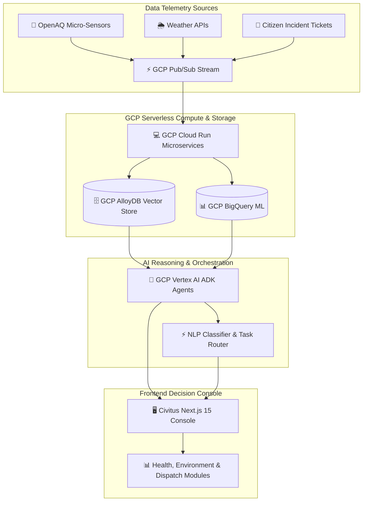

# 🏛️ Civitus AI: Community Intelligence & Autonomous Decision Engine

[](https://nextjs.org/)
[](https://react.dev/)
[](https://www.typescriptlang.org/)
[](https://cloud.google.com/)
[](https://tailwindcss.com/)
[](LICENSE)

> **Civitus AI** is a state-of-the-art, full-stack municipal decision intelligence platform built for public health emergency response, environmental telemetry tracking, and predictive civic workflow automation. Developed with Next.js 15, React 19, GSAP smooth scroll animations, and powered by Google Cloud serverless infrastructure.

---

## 🌟 Core Capabilities

* 🏥 **Predictive Health Intelligence**:
  * Clinical patient intake forecasting connected to Google BigQuery ML models.
  * Real-time hospital bed availability and emergency capacity overload detection up to **48 hours in advance**.
* 🌿 **Environmental Telemetry & AQI Monitoring**:
  * Micro-particulate PM2.5 and PM10 sensor indexing via real-time OpenAQ API sync.
  * Localized atmospheric inversion layer alerts, weather telemetry, and GIS spatial mapping.
* ⚡ **Predictive Dispatch & Automated Routing**:
  * Natural Language Processing (NLP) classification engine for citizen report tickets.
  * Auto-dispatches prioritized public service task queues directly to repair crews.
* 💻 **Interactive Telemetry Playground**:
  * Real-time API payload inspector for Weather, OpenAQ, and Citizen Incident tickets.
* 🎨 **Luxury Neomorphic & Glassmorphic UI/UX**:
  * Canvas-driven 3D scroll hero animation sequence (260 frames).
  * Geolocation-aware floating luxury navigation header with live regional clock and weather indicator.

---

## 🏗️ System Architecture



---

## 🛠️ Tech Stack Breakdown

| Layer | Technology | Description |
| :--- | :--- | :--- |
| **Framework** | Next.js 15.5 (App Router) | High-performance server/client rendered web application |
| **UI Library** | React 19.1 + Tailwind CSS v4 | Neomorphic glassmorphic design system |
| **Animations** | GSAP 3.15 + ScrollTrigger | Canvas frame interpolation & smooth scroll transitions |
| **Icons** | Lucide React | Clean, modern vector iconography |
| **Cloud Infrastructure**| Google Cloud Platform (GCP) | Pub/Sub, Cloud Run, BigQuery ML, AlloyDB Vector Search |
| **AI Orchestration** | Google Vertex AI ADK | Multi-agent reasoning and NLP ticket classification |

---

## 📁 Project Structure

```
Civitus_AI-for-community/
├── civitus-app/               # Main Next.js 15 Application
│   ├── src/
│   │   ├── app/
│   │   │   ├── page.tsx       # Main Landing Page & Interactive Platform View
│   │   │   ├── layout.tsx     # Global Font & Metadata Configuration
│   │   │   └── globals.css    # Custom Neomorphic & Glassmorphic Utilities
│   │   └── components/
│   │       ├── ScrollHero.tsx        # Canvas 3D Scroll Frame Animation Hero
│   │       └── PlatformDashboard.tsx # Executive Municipal Intelligence Console
│   ├── public/                # Static Media & Icons
│   ├── next.config.ts         # Next.js Configuration
│   ├── tailwindcss / postcss  # Tailwind v4 Configuration
│   ├── vercel.json            # Vercel Deployment Configuration
│   └── package.json           # Application Dependencies
├── imagess/                   # 260 Canvas Animation Frame Assets
├── .gitignore                 # Excluded Build Files & Secrets
├── LICENSE                    # MIT Open Source License
└── README.md                  # Main Repository Documentation
```

---

## 🚀 Quick Start Guide

### Prerequisites
* **Node.js**: `v18.18+` or `v20+`
* **npm** / **yarn** / **pnpm**

### Installation Steps

1. **Clone the Repository**
   ```bash
   git clone https://github.com/PremVishal21/Civitus_AI-for-community.git
   cd Civitus_AI-for-community/civitus-app
   ```

2. **Install Dependencies**
   ```bash
   npm install
   ```

3. **Configure Environment Variables**
   Create a `.env.local` file inside `civitus-app/`:
   ```bash
   cp .env.example .env.local
   ```

4. **Run Development Server**
   ```bash
   npm run dev
   ```
   Open [http://localhost:3000](http://localhost:3000) in your browser to launch Civitus AI.

5. **Build for Production**
   ```bash
   npm run build
   npm run start
   ```

---

## ☁️ Deployment

This project is pre-configured for seamless deployment on **Vercel** via `civitus-app/vercel.json`:

[](https://vercel.com/new/clone?repository-url=https%3A%2F%2Fgithub.com%2FPremVishal21%2FCivitus_AI-for-community)

---


---

<p align="center">
  Built with ❤️ for the <strong>Google Cloud GenAI Hackathon</strong> by <a href="https://github.com/PremVishal21">Prem Vishal</a>
</p>
